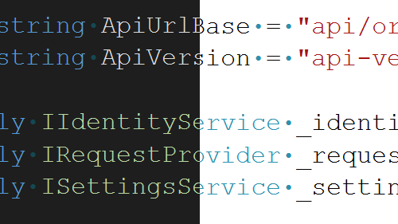

Chápeme, že výběr písma při kódování je osobní volbou vývojářů, která je ovlivněna preferencemi týkající se čitelnosti, přístupnosti nebo estetiky. Motivy sady Visual Studio se primárně zaměřují na barvy prezentace a jsou nezávislé na upřednostňovaných písmech.

V této aktualizaci jsme zavedli funkce, které při přepínání motivů zachovávají vaši volbu typu a velikosti písma. Nyní můžete jednou nastavit předvolby písma a přepínat motivy v sadě Visual Studio, aniž byste museli pokaždé znovu konfigurovat nastavení písma. Všimněte si, že barvy písma zůstanou propojené s motivem, protože to je účel motivů, ale výběry písma se zachovají.

Tato funkce bude ve výchozím nastavení povolená pro všechny uživatele. Pokud dáváte přednost předchozímu chování, přejděte na [Nástroje > Spravovat funkce Preview](vscmd://Tools.ManagePreviewFeatures) a vyhledejte možnost **Oddělit nastavení písma od výběru barevného motivu**. Pokud je tato možnost zaškrtnutá, vaše předvolby písma se zachovají bez ohledu na změny motivu. Zrušením zaškrtnutí políčka obnovíte předchozí chování, které spojuje volby písma s motivem.
