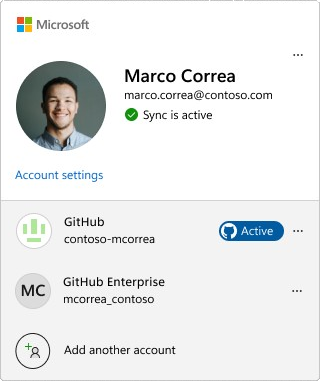

Potřebujete pro své vývojové scénáře využívat různé účty GitHub? Visual Studio teď umožňuje využívat více účtů GitHub najednou!

### Přidání více účtů GitHubu
Více účtů přidáte velmi snadno! Jednoduše otevřete kartu profilu, vyberte **Přidat další účet**, přihlaste se ke svému účtu GitHub a podle potřeby postup zopakujte.

Účty můžete přidat také z dialogového okna Nastavení účtu v části **Soubor > Nastavení účtu**.

### Nastavení aktivního účtu GitHubu

Pokud přidáte více účtů GitHub, Visual Studio se ve výchozím nastavení nastaví na ten, který je označený jako *aktivní*, pro funkce s podporou GitHubu, jako je správa verzí a Copilot. 

Pokud chcete přepnout aktivní účet, přejděte do možností účtu a vyberte tlačítko **Nastavit jako aktivní účet**.

### Dopad na GitHub Copilot

Copilot se aktivuje automaticky, když je aktivní účet GitHub přihlášen k odběru služby GitHub Copilot pro jednotlivce nebo GitHub Copilot pro firmy.

### Dopad na správu verzí

Při práci na žádostech o přijetí změn nebo problémech v GitHubu se zobrazí výzva k nastavení účtu GitHub. Vaše předvolby si zapamatujeme pokaždé, když pracujete v konkrétním úložišti, takže když změníte úložiště, nemusíte si dělat starosti s přepínáním účtů pro běžné operace Gitu, jako je přijetí změn, nasdílení změn a načtení změn. Pokud dojde k neshodě, budete vyzváni k aktualizaci aktivního účtu, abyste se vyhnuli použití nesprávného účtu.

### Chcete to vyzkoušet?
Aktivujte nástroj GitHub Copilot Free a odemkněte tuto funkci využívající umělou inteligenci a mnoho dalších.
 Žádná zkušební verze. Žádná platební karta. Jen váš účet GitHub. [Získejte nástroj Copilot Free](vscmd://View.GitHub.Copilot.Chat).
