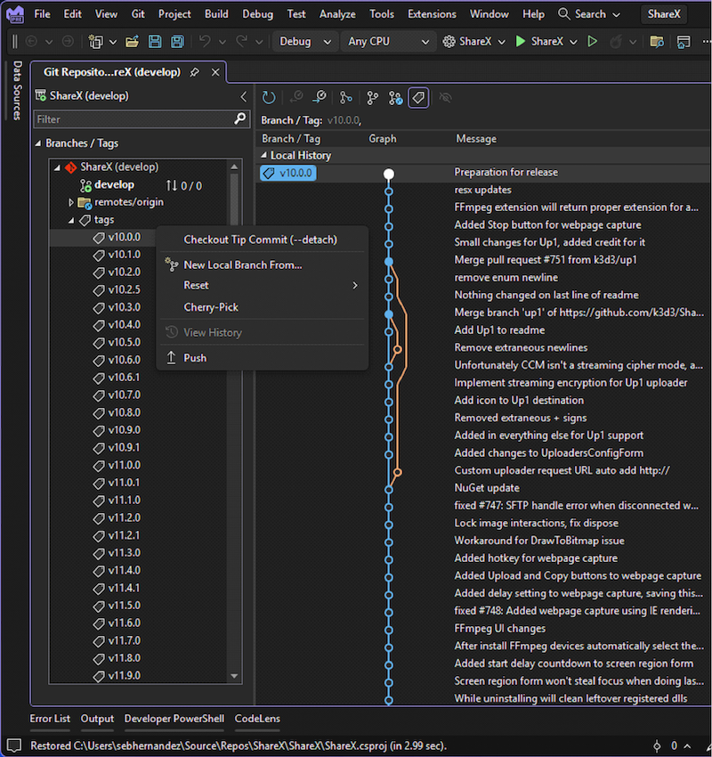

Visual Studio s nejnovější aktualizací umožňuje bezproblémově zobrazovat a spravovat značky Gitu přímo v okně úložiště Gitu. Můžete snadno přejít na konkrétní potvrzení přidružené ke značce a zobrazit si místní nabídku s akcemi, které lze u značky provést. Tento zjednodušený pracovní postup umožňuje zůstávat ve známém prostředí IDE a zvyšuje produktivitu a efektivitu při práci se značkami Gitu.

