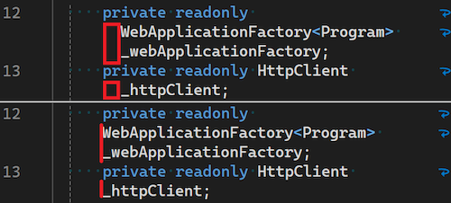

S potěšením představujeme novou funkci, která umožňuje zobrazovat v editoru zalomené řádky s odsazením. Toto vylepšení nabízí větší flexibilitu a přizpůsobení prostředí kódování a zajišťuje, aby se kód zobrazoval přesně podle vašich představ.

Pokud chcete tuto možnost změnit, postupujte takto:

1. Přejděte na **Nástroje > Možnosti > Textový editor > Obecné**.
2. Vyhledejte možnost **Automatické odsazení při povoleném zalamování řádků**.

Ve výchozím nastavení je tato možnost povolená, což znamená, že zalomené řádky budou odsazené. Pokud nechcete, aby zalomené řádky byly odsazené, stačí zaškrtnutí této možnosti zrušit. Toto nastavení může pomoct zlepšit čitelnost a udržovat požadované formátování kódu, zejména v projektech, kde má styl odsazování zásadní význam.

Věříme, že tato nová funkce zvýší vaši produktivitu a usnadní vám psaní kódu.
