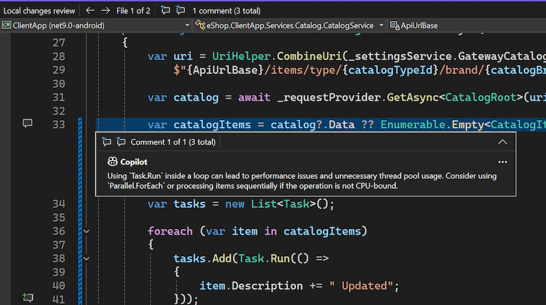

Jetzt können Sie eine GitHub Copilot-Codeüberprüfung zu Ihren lokalen Änderungen erhalten bevor Sie einen Commit ausführen! Wenn Ihr Copilot-Abonnement in Visual Studio aktiviert ist und die folgenden Feature-Flags aktiviert sind, können Sie die neue Sparkle-Kommentarschaltfläche im Fenster „Git-Änderungen“ sehen. Wenn Sie geklickt haben, überprüft Copilot Ihre Änderungen und schlägt einige Vorschläge direkt in Ihrem Editor vor.

Das Modell kann auf kritische Probleme hinweisen, z. B. potenzielle Leistungs- und Sicherheitsprobleme. Die frühzeitige Erkennung solcher Probleme reduziert das Risiko, dass Probleme in Ihre Remotecodebasis gepusht werden.

Stellen Sie sicher, dass Sie beide der folgenden Feature-Flags aktiviert haben:

- **Tools** > **Optionen** > **Preview-Features** > **Pull Request-Kommentare**
- **Tools** > **Optionen** > **GitHub** > **Copilot** > **Integration der Quellcodeverwaltung** > **Git-Previewfunktionen aktivieren**.

### Möchten Sie es selbst ausprobieren?
Aktivieren Sie GitHub Copilot Free, und nutzen Sie dieses und viele weitere KI-Features.
 Keine Testversion. Keine Kreditkarte Sie benötigen nur Ihr GitHub-Konto. [Laden Sie Copilot Free herunter](vscmd://View.GitHub.Copilot.Chat).
