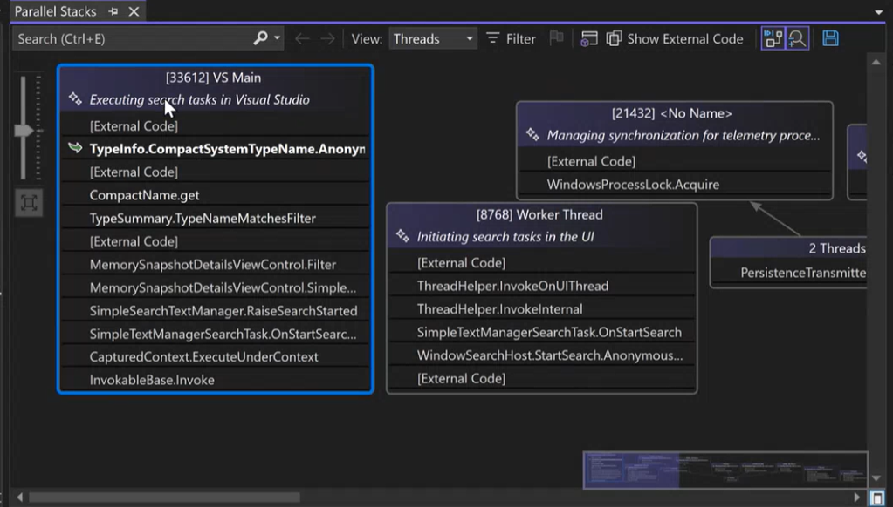

Mit dem GitHub Copilot-Feature „Automatisches Zusammenfassen“ im Fenster **Parallele Stapel** können Sie komplexe Multithreadprogramme jetzt effizienter debuggen. Diese Erweiterung bietet klare, präzise Threadzusammenfassungen, die es einfacher machen, Probleme nachzuverfolgen und das Threadverhalten auf einen Blick zu verstehen.

Wenn Sie Copilot in Visual Studio verwenden, sehen Sie im Fenster **Parallele Stapel** über jedem Thread eine neue KI-generierte Zusammenfassungszeile. Diese Zusammenfassungen bieten einen allgemeinen Überblick über die aktuelle Aktivität der einzelnen Threads und helfen Ihnen, ihren Zweck und Status schnell zu erfassen.  

Dieses Feature spart Ihnen Zeit und Mühe, indem wichtige Threadinformationen in einem intuitiven, lesbaren Format dargestellt werden, sodass Sie sich auf die Lösung von Problemen konzentrieren können, anstatt komplexe Threadstrukturen zu entwirren.  

Testen Sie es noch heute, und erleben Sie mit den neuesten KI-gestützten Tools in Visual Studio eine optimierte Debugerfahrung.

### Möchten Sie es selbst ausprobieren?
Aktivieren Sie GitHub Copilot Free, und nutzen Sie dieses und viele weitere KI-Features.
 Keine Testversion. Keine Kreditkarte Sie benötigen nur Ihr GitHub-Konto. [Laden Sie Copilot Free herunter](vscmd://View.GitHub.Copilot.Chat).
