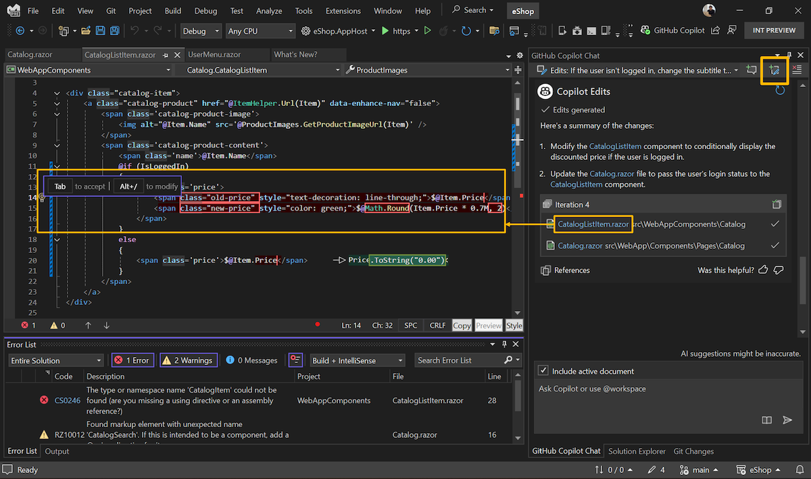

Copilot in Visual Studio kann Ihnen jetzt helfen, Ihren Code mit Copilot Edits zu verfeinern, einem Feature, das die Iteration über mehrere Dateien effizienter macht.

Klicken Sie zunächst auf die Schaltfläche, um oben im Copilot-Chatbereich einen Bearbeitungsthread zu erstellen.

Copilot Edits kombiniert den Unterhaltungsfluss des Chats mit einer Inlineüberprüfung, um Entwicklern Folgendes zu ermöglichen:

1. **Vorschau mit Klarheit**: Copilot Edits beginnt mit einer Zusammenfassung der betroffenen Dateien und den vorgeschlagenen Änderungen, sodass Sie genau wissen, was passiert.
2. **Überprüfen mit dem Flow**: Anzeigen von Code-Diffs inline, direkt in Ihrem Editor. Mit den Tasten `TAB` bzw. `Alt+Del` können Sie einzelne Änderungen annehmen bzw. ablehnen oder alle Änderungen auf einmal übernehmen bzw. verwerfen.
3. **Sicheres Durchlaufen von Dateien**: Mithilfe von Prüfpunkten können Sie bei Bedarf frühere Iterationen einer Codedatei erneut aufrufen oder einen anderen Ansatz ausprobieren – perfekt, wenn die Inspiration wieder zuschlägt.

Beginnen Sie, indem Sie die Änderungen beschreiben, die Sie in natürlicher Sprache wünschen, und verweisen Sie auf bestimmte Dateien, Fehler oder Ihre Projektmappe, indem Sie den #-Schlüssel auf die gleiche Weise verwenden wie in Copilot Chat.

### Möchten Sie es selbst ausprobieren?
Aktivieren Sie GitHub Copilot Free, und nutzen Sie dieses und viele weitere KI-Features.
 Keine Testversion. Keine Kreditkarte Sie benötigen nur Ihr GitHub-Konto. [Laden Sie Copilot Free herunter](vscmd://View.GitHub.Copilot.Chat).
