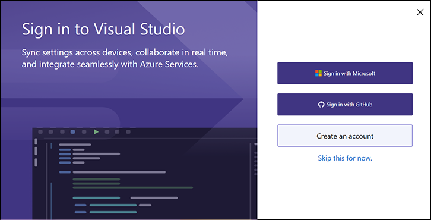
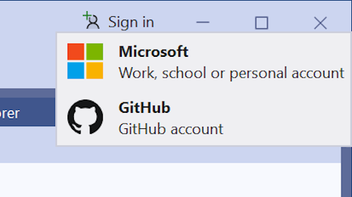

Müssen Sie mit GitHub-Ressourcen arbeiten? Das Hinzufügen Ihres GitHub-Kontos ist jetzt einfacher denn je! 

### Neue Möglichkeiten zum Anmelden mit Ihrem GitHub-Konto

Sie können sich jetzt während des ersten Startkonfigurationsdialogfelds mit Ihrem GitHub-Konto anmelden:

Wenn Sie die Einstellung für das erste Startkonto überspringen möchten, können Sie sich auch direkt über die VS-Shell anmelden, ohne zuerst ein Microsoft-Konto hinzufügen zu müssen.

Bitte beachten Sie, dass Sie Ihre Einstellungen erst synchronisieren können, wenn Sie Visual Studio ein Microsoft-Konto (Geschäfts-, Schul- oder Unikonto oder ein persönliches Konto) hinzufügen.
