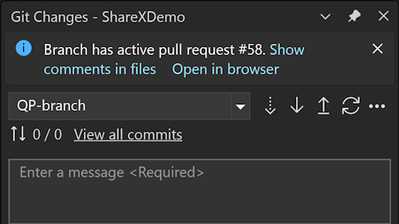
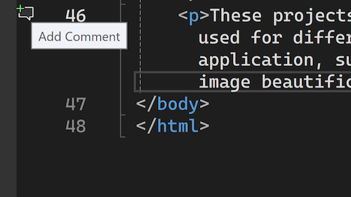

With the latest update, you can now add new comments to pull request files on the checked-out branch. This was a top request for the pull request experience and is the latest in a series of improvements to the pull request experience in Visual Studio.

### Get Started

Enable the feature flags **Pull Request Comments** and **Pull Request Add Comment**, check out any branch with an active pull request, and select **Show comments in files** in the InfoBar. This will activate the pull request comments experience in the editor.

To add a new comment to a file, select the **Add Comment** icon in the margin, or right-click the line you'd like to add a comment on and choose **Git > Add Comment** from the context menu.

Note: The icon will show only in files that are part of the pull request. For GitHub pull requests, you'll only be able to comment on lines surrounding and including the lines that have been changed.
