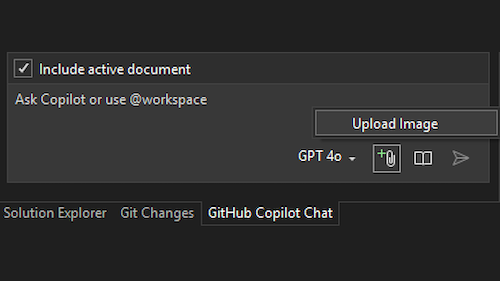

Ever wanted to share an image with your AI pair programmer to help explain a concept or show an example? Now you can! With the new feature, you can attach images in GitHub Copilot chat to help you better communicate exactly what you need.

### Important Note

As this feature is in preview, it may not be available to all users. Due to the gradual rollout, you may not see the option to attach images in chat immediately.

### Get Started

All you need to do is either paste an image from your clipboard or use the paperclip icon in the chat window to upload your image from file explorer. Then, simply add your prompt text and send! Copilot will then analyze the image and use it as additional context to generate a better response. This can be especially useful for tasks like ui development, where outlining a design or layout can be challenging with text alone. By attaching an image, you can help Copilot better understand your vision and generate more accurate code suggestions. It can also be useful when debugging, where you can share a screenshot of an error message or a code snippet to get more accurate suggestions.

The accepted file types are PNG, JPG, and GIF (though, the model will only take a single frame of an animated gif), and you can attach up to 3 images per message. Additionally, several models support vision capabilities, including the GPT-4o model and Claude 3.5 Sonnet.

### Want to try this out?
Activate GitHub Copilot Free and unlock this AI feature, plus many more.
No trial. No credit card. Just your GitHub account. [Get Copilot Free](vscmd://View.GitHub.Copilot.Chat).
