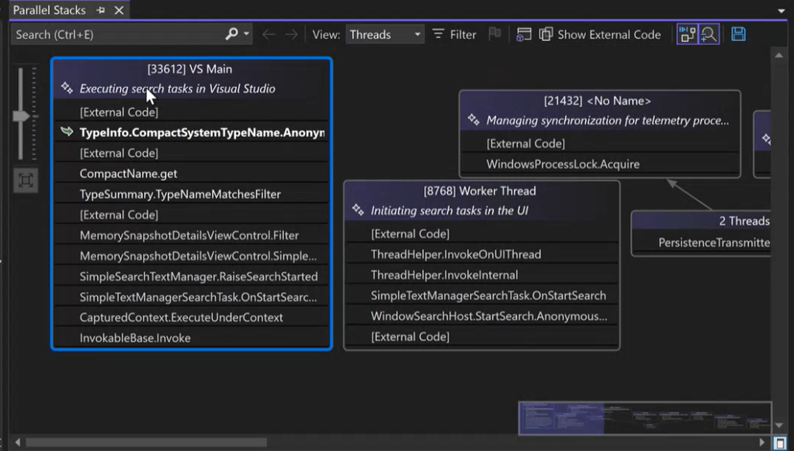

Debugging complex, multi-threaded programs is now more efficient with the GitHub Copilot Auto-Summarize feature in the **Parallel Stacks** window. This enhancement delivers clear, concise thread summaries, making it easier to trace issues and understand thread behavior at a glance.

When using Copilot in Visual Studio, you'll see a new AI-generated summary row at the top of each thread in the **Parallel Stacks** window. These summaries provide a high-level overview of each thread's current activity, helping you quickly grasp their purpose and status.  

This feature is designed to save you time and effort by presenting essential thread information in an intuitive, readable format, enabling you to focus on solving problems rather than untangling complex thread structures.  

Try it today and experience streamlined debugging with the latest AI-powered tools in Visual Studio!

### Want to try this out?
Activate GitHub Copilot Free and unlock this AI feature, plus many more.
No trial. No credit card. Just your GitHub account. [Get Copilot Free](vscmd://View.GitHub.Copilot.Chat).
