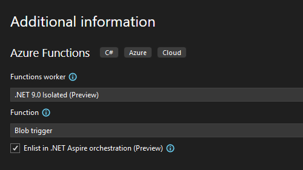
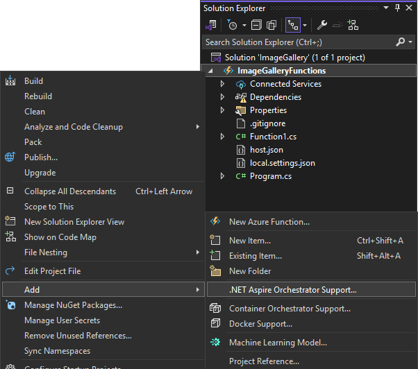
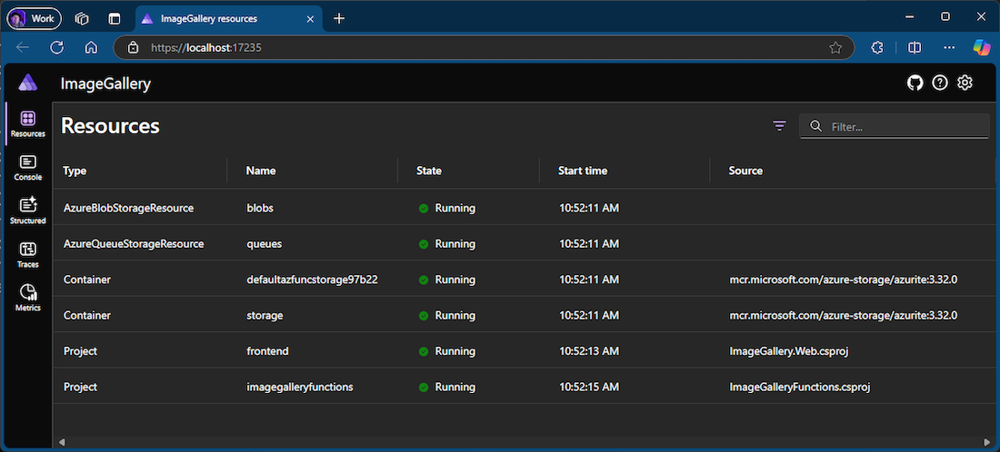

With this release of Visual Studio, Azure Functions developers can now leverage .NET Aspire orchestration when creating a new Azure Functions project. By selecting this option, an App Host and a Service Defaults project will be included in your solution when the Functions project is created.

If you have an existing Azure Functions project, such as one integrated with an ASP.NET Core Blazor front-end web app, you can add .NET Aspire support to it, just as you could with ASP.NET Core apps prior to this release.

Additionally, running or debugging an Azure Functions project with .NET Aspire support will launch the .NET Aspire dashboard in your browser. This allows you to monitor the execution of your Azure Functions in real-time. You can observe how the .NET Aspire orchestrator manages the execution of your Azure Functions and even pause and resume their execution from the dashboard.

We are excited about this integration and look forward to seeing how you will incorporate Azure Functions into your .NET Aspire projects.
