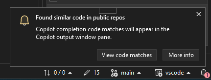
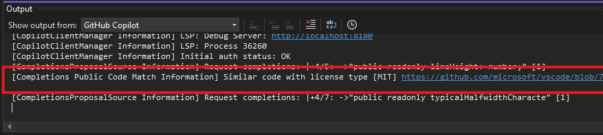

We're excited to announce that code referencing is now available in GitHub Copilot Completions within Visual Studio, a feature previously introduced in GitHub Copilot Chat! 

This new functionality offers developers greater transparency on their code completions (or *gray text*) by providing detailed information on any public code matches found. 
When you accept a completion that matches code in a public GitHub repository for the first time in your solution, a toast notification will appear on the bottom right of your editor.

All public code match details will be available in your GitHub Copilot Output Window, including the license type and a link to the GitHub.com, the public repository where the original code is located. 

Now, just like with GitHub Copilot Chat, you can code with more transparency and confidence using GitHub Copilot Completions!

If you are an individual subscriber and want to manage or learn more about the code referencing setting, see [documentation](https://docs.github.com/en/copilot/managing-copilot/managing-copilot-as-an-individual-subscriber/managing-copilot-policies-as-an-individual-subscriber#enabling-or-disabling-suggestions-matching-public-code)

### Want to try this out?
Activate GitHub Copilot Free and unlock this AI feature, plus many more.
No trial. No credit card. Just your GitHub account. [Get Copilot Free](vscmd://View.GitHub.Copilot.Chat).
