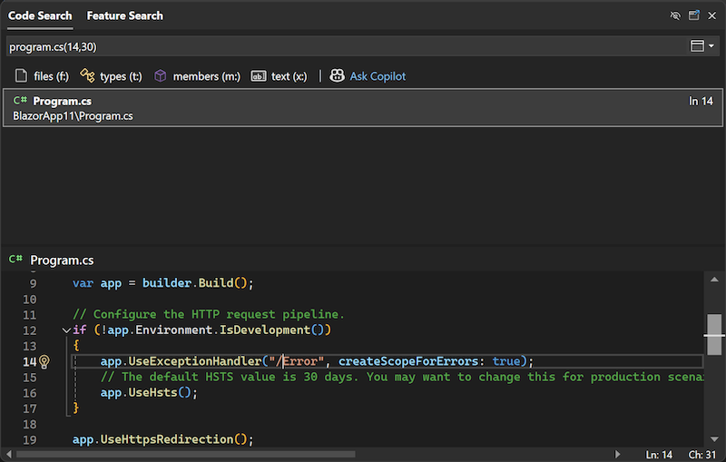

In [Code Search](vscmd://Edit.NavigateTo), we've significantly enhanced line navigation capabilities. The following formats are now supported:

- `:line` to navigate to a specific line in the active document
- `:line,col` to navigate to a specific line and column in the active document
- `file:line` to navigate to a specific line in a specified file
- `file:line,col` to navigate to a specific line and column in a specified file
- `file(line)` to navigate to a specific line in a specified file
- `file(line,col)` to navigate to a specific line and column in a specified file

These improvements make it easier to quickly locate and edit code, enhancing your productivity and streamlining your workflow.
