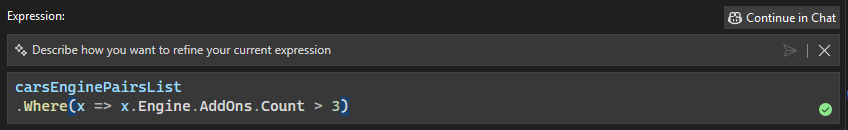

The IEnumerable Visualizer now features inline chat for its editable expression, enabling users to leverage AI directly within the IEnumerable Visualizer to craft complex LINQ queries for the editable expression. 

### Editable Expression Inline Chat

To bring up the inline chat, simply click the GitHub Copilot sparkle button located in the bottom-right corner of the editable expression text box. This will open a text box above the original editable expression, with a prompt that says *Describe how you want to refine your current expression*. Enter your request in natural language, and once you're ready, click the **Submit** button.

GitHub Copilot will generate a LINQ query based on your input and automatically execute it by default. To confirm that the query has been successfully generated and applied, look for the green checkmark, which indicates that the LINQ query generated by GitHub Copilot has been fully executed and applied.

### Continue to GitHub Copilot Chat
The feature also includes a **Continue in Chat** button after at least one LINQ query has been generated by GitHub Copilot, conveniently located at the top-right corner of the text box. 

Clicking this button opens a dedicated GitHub Copilot Chat window where you can refine your query, ask follow-up questions, or explore alternative approaches in more detail. This integration ensures you maintain control and flexibility while leveraging the full capabilities of GitHub Copilot.

When you're ready to return to the visualizer, simply click the **Show in Visualizer** button. This allows you to seamlessly transition back to the visualizer environment, where you can view or apply the changes generated during your chat session.

This feature provides a fluid workflow between the visualizer and GitHub Copilot Chat. The inline chat is optimized for quick edits and small adjustments, while the GitHub Copilot Chat excels at handling more detailed refinements and iterative improvements, both of which aim to make generating LINQ queries for editable expression easier and more efficient.

### Want to try this out?
Activate GitHub Copilot Free and unlock this AI feature, plus many more.
No trial. No credit card. Just your GitHub account. [Get Copilot Free](vscmd://View.GitHub.Copilot.Chat).
