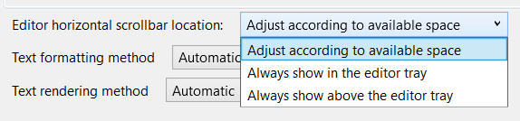

The editor tray in Visual Studio is a valuable space for a wealth of information. You can control your zoom, check the health of your document, see what line you're on, and access a variety of additional information.

Unfortunately, sometimes all of that information can crowd out the horizontal scrollbar, making it difficult to scroll through your window. This is particularly true in a side-by-side view where the system tray isn't very wide.

With this latest update, these struggles are a thing of the past. If the scrollbar drops below a usable width, it will reposition itself above the system tray to ensure it's always accessible. By default, it will return to the editor tray as soon as there's enough room for it again.

While we believe this behavior will be ideal for most users, if you encounter any issues, you can control the behavior in **Tools > Options**. The option is located under **Text Editor > Advanced** and is labeled **Editor horizontal scrollbar location**. This setting allows you to choose whether the scrollbar adjusts its position according to the available space, stays in the editor tray, or always appears above the editor tray.

