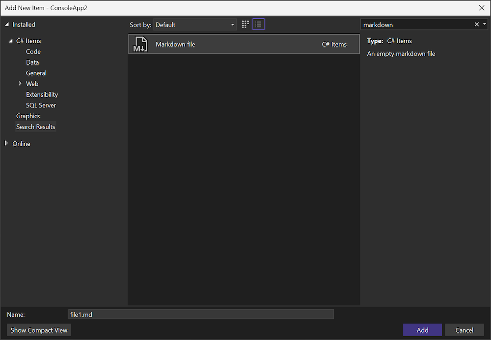

Creating a new markdown file in your project is now simpler with the **Markdown file** template available in the **Add New Item** dialog. This template provides a convenient starting point for your markdown content.

To add a new markdown file to your project, follow these steps:

1. In Solution Explorer, right-click the project or folder where you want to add the markdown file.
2. Select **Add** > **New Item**.
3. In the **Add New Item** dialog, select **Markdown file**.
4. Enter a name for the file and click **Add**.
