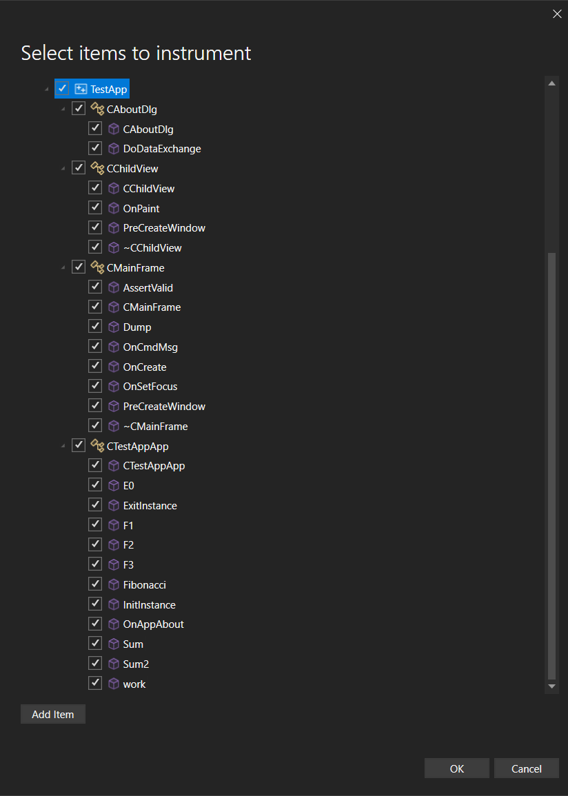

The Visual Studio profiler's instrumentation tool now supports targeted instrumentation for native code, allowing you to select specific classes and functions for detailed analysis.

This feature enhances performance monitoring and helps pinpoint issues more efficiently, streamlining your debugging process.

This precision allows for deeper insights into performance bottlenecks and accelerates your profiling efforts.
