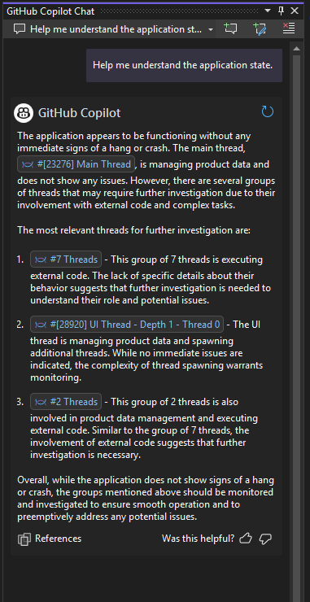
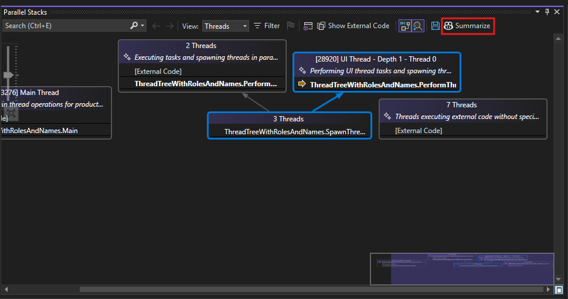

Visual Studio now offers an enhanced debugging experience with **Copilot Chat Integration** in the Parallel Stacks window. This feature allows you to quickly gain context and insights about each thread's activity. Instead of just presenting raw call stacks, this integration leverages GitHub Copilot's AI-driven summarization to provide clear overviews of each thread's actions, potential issues, and fixes. This results in a more intuitive approach to multi-threaded debugging, significantly reducing the time needed to understand and resolve complex thread interactions.

To use this feature, simply click the **Summarize** button at the top of the Parallel Stacks window. This will open the Copilot Chat on the side, preloaded with relevant thread context. You can then explore deeper details, including thread states, function calls, and suggested fixes—all through an interactive, AI-powered conversation. By seamlessly combining parallel stack insights with Copilot Chat's auto-generated summaries, Visual Studio streamlines your debugging workflow, empowering you to diagnose, understand, and address threading issues with greater confidence and speed.

Try it today and experience streamlined debugging with the latest AI-powered tools in Visual Studio!

### Want to try this out?
Activate GitHub Copilot Free and unlock this AI feature, plus many more.
No trial. No credit card. Just your GitHub account. [Get Copilot Free](vscmd://View.GitHub.Copilot.Chat).
