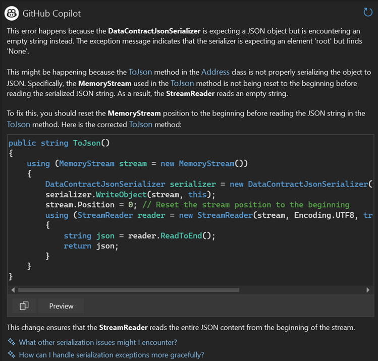

GitHub Copilot Exception Analysis and Variable Analysis now intelligently leverage your project context to identify and highlight relevant code contributing to errors. 

By offering sharper, actionable insights and smarter, context-aware solutions, these features can help you resolve issues faster, streamline your debugging workflow, and improve overall accuracy in error troubleshooting.

### Want to try this out?
Activate GitHub Copilot Free and unlock this AI feature, plus many more.
No trial. No credit card. Just your GitHub account. [Get Copilot Free](vscmd://View.GitHub.Copilot.Chat).
