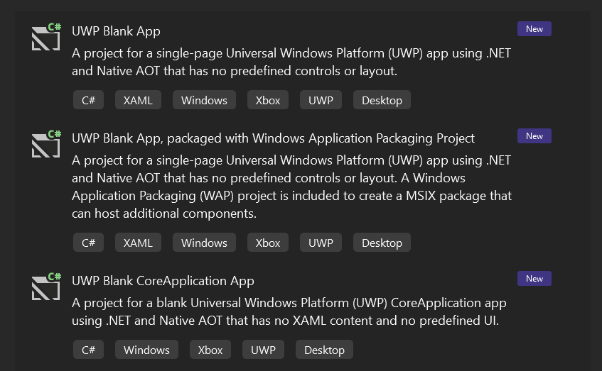

Visual Studio now includes new UWP projects targeting .NET 9 and Native AOT. You can use these new templates to easily create a new UWP XAML or CoreApplication app, a class library, or a WinRT component. This makes it much easier to get started with the new tooling, and to migrate existing UWP apps using .NET Native.

The original UWP project templates using .NET Native will remain available, however it is recommended to use the new project templates targeting .NET 9 and Native AOT going forwards. We have adjusted the ordering of all UWP templates to reflect this, and prioritize the new .NET 9 project templates as well.
