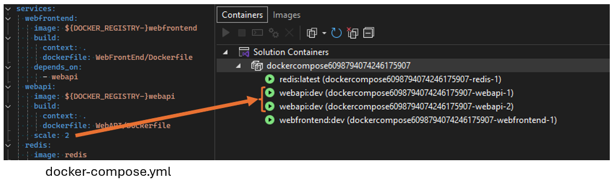

Ahora puede agregar la propiedad `scale` a la configuración del servicio de Docker Compose para depurar con un número específico de réplicas en ejecución. Por ejemplo, la siguiente configuración ejecutará dos instancias del servicio `webapi` cuando se inicie.

Esta mejora permite pruebas de carga y depuración más eficaces de las aplicaciones mediante la simulación de un entorno similar a producción. También simplifica el flujo de trabajo, ya que facilita la administración de varias instancias directamente desde el archivo de Compose. Esta característica es especialmente útil para probar el comportamiento de los servicios en carga y garantizar que la aplicación pueda controlar varias instancias sin problemas.
