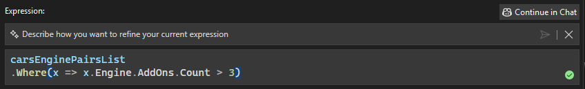

El visualizador IEnumerable ahora incluye chat en línea para su expresión editable, lo que permite a los usuarios aprovechar la inteligencia artificial directamente dentro del visualizador IEnumerable para crear consultas LINQ complejas para la expresión editable. 

### Chat en línea de expresión editable

Para abrir el chat en línea, simplemente haga clic en el botón GitHub Copilot ubicado en la esquina inferior derecha del cuadro de texto de la expresión editable. Se abrirá un cuadro de texto encima de la expresión editable original, con un mensaje que indica *Describa cómo desea ajustar la expresión actual*. Escriba la solicitud en lenguaje natural y, una vez que esté listo, haga clic en el **botón Enviar**.

GitHub Copilot generará una consulta LINQ basada en la entrada y la ejecutará automáticamente de forma predeterminada. Para confirmar que la consulta se ha generado y aplicado correctamente, busque la marca de verificación verde, que indica que la consulta LINQ generada por GitHub Copilot se ha ejecutado y aplicado por completo.

### Continuar con el chat de GitHub Copilot
La característica también incluye un botón de **Continuar en el chat** después de que GitHub Copilot haya generado al menos una consulta LINQ, ubicada convenientemente en la esquina superior derecha del cuadro de texto. 

Al hacer clic en este botón se abre una ventana dedicada de chat de GitHub Copilot, donde puede ajustar la consulta, formular preguntas de seguimiento o explorar enfoques alternativos con más detalle. Esta integración garantiza el control y la flexibilidad al aprovechar todas las funcionalidades de GitHub Copilot.

Cuando esté listo para volver al visualizador, simplemente haga clic en el botón **Mostrar en visualizador**. Esto le permite volver sin problemas al entorno del visualizador, donde puede ver o aplicar los cambios generados durante la sesión de chat.

Esta característica proporciona un flujo de trabajo fluido entre el visualizador y el chat de GitHub Copilot. El chat en línea está optimizado para modificaciones rápidas y pequeños ajustes, mientras que el chat de GitHub Copilot destaca por el control de ajustes más detallados y mejoras iterativas, ambos con el fin de hacer que la generación de consultas LINQ para expresiones editables sea más fácil y eficaz.

### ¿Quiere probarlo?
Active GitHub Copilot Free y descubra esta característica de IA, además de muchas más.
 Sin pruebas. Sin tarjeta de crédito. Tan solo su cuenta de GitHub. [Obtenga Copilot Free](vscmd://View.GitHub.Copilot.Chat).
