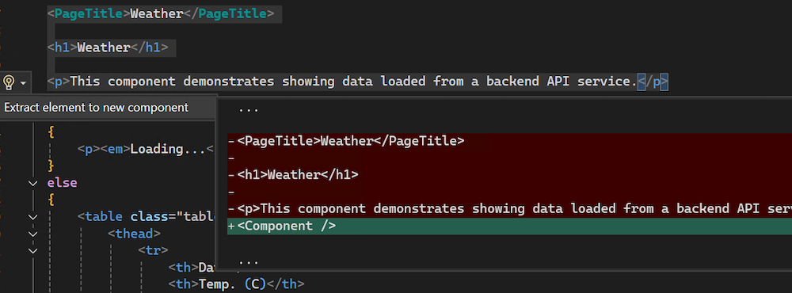

¿Se ha encontrado alguna vez agregando demasiado código a un archivo *.razor* y quería una forma fácil de trasladarlo a su propio componente reutilizable? Al trabajar con HTML en un archivo de Razor, ahora puede usar `CTRL+.` o hacer clic con el botón derecho y seleccionar **Acciones rápidas y refactorizaciones** para extraer automáticamente el marcado HTML seleccionado en un nuevo componente de Razor en Visual Studio.

En esta primera iteración, la función *Extraer elemento en nuevo componente* solo se admite con selecciones de marcado HTML. 

Esta mejora simplifica el flujo de trabajo al permitirle modular los componentes de Razor sin esfuerzo.
