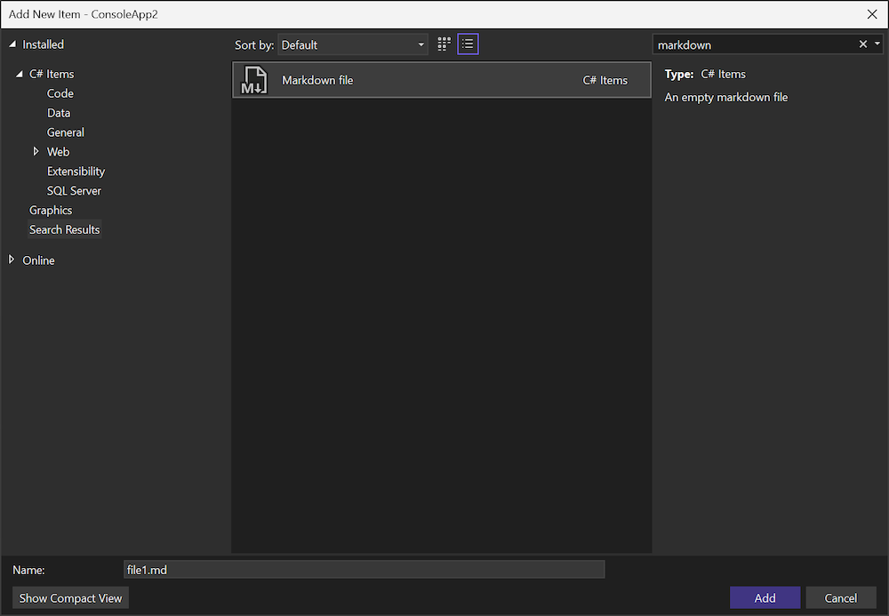

La creación de un archivo markdown en el proyecto ahora es más sencilla con la plantilla de **archivo Markdown** disponible en el cuadro de diálogo **Agregar nuevo elemento**. Esta plantilla proporciona un punto de partida cómodo para el contenido de Markdown.

Para agregar un nuevo archivo markdown al proyecto, siga estos pasos:

1. En el Explorador de soluciones, haga clic con el botón derecho en el proyecto o carpeta donde desea agregar el archivo markdown.
2. Seleccione **Agregar** > **Nuevo elemento**.
3. En el cuadro de diálogo **Agregar nuevo elemento**, seleccione **Archivo Markdown**.
4. Escriba un nombre para el archivo y haga clic en **Agregar**.
