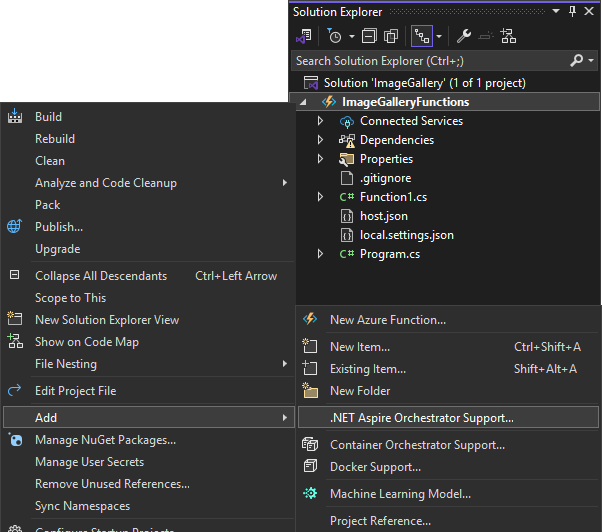

Dans cette version de Visual Studio, les développeurs Azure Functions peuvent profiter de l’orchestration .NET Aspire lors de la création d’un nouveau projet Azure Functions. En sélectionnant cette option, un hôte d’application et un projet de service par défaut sont inclus dans votre solution lorsque le projet Functions est créé.

Si vous disposez d’un projet Azure Functions existant, tel qu’un projet intégré à une application web front-end ASP.NET Core Blazor, vous pouvez y ajouter la prise en charge de .NET Aspire, tout comme vous le faisiez avec les applications ASP.NET Core antérieures à cette version.

En outre, l’exécution ou le débogage d’un projet Azure Functions avec la prise en charge de .NET Aspire lance le tableau de bord .NET Aspire dans votre navigateur. Cela vous permet de surveiller l’exécution de vos fonctions Azure en temps réel. Vous pourrez voir comment l’orchestrateur .NET Aspire gère l’exécution de vos Azure Functions, et même suspendre ou reprendre leur exécution depuis le tableau de bord.

Nous sommes ravis de cette intégration et impatients de voir comment vous allez incorporer Azure Functions dans vos projets .NET Aspire.
