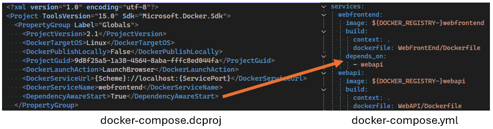

Nous sommes heureux d’introduire une nouvelle option de configuration de lancement appelée `DependencyAwareStart`. Lorsque cette option est définie sur `True`, elle modifie la façon dont les projets Docker Compose sont lancés en activant l’utilisation de la directive `depends_on` dans votre configuration Compose.

Cette fonctionnalité garantit que les conteneurs spécifiés sont démarrés dans le bon ordre, en respectant les exigences de dépendance définies dans votre fichier Docker Compose. En gérant les dépendances de manière plus efficace, elle améliore la robustesse et la fiabilité des applications multi-conteneurs.
