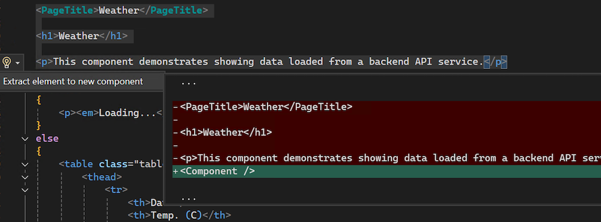

Vous êtes-vous déjà retrouvé à ajouter trop de code à un fichier *.razor* et avez-vous voulu un moyen facile de le déplacer vers son propre composant réutilisable ? Lorsque vous travaillez avec du HTML dans un fichier Razor, vous pouvez désormais utiliser `CTRL+.` ou faire un clic droit et sélectionner **Actions rapides et Refactorisations** pour extraire automatiquement votre balisage HTML sélectionné en un nouveau composant Razor dans Visual Studio !

Dans cette première itération, la fonctionnalité *Extraire élément vers nouveau composant* est uniquement prise en charge avec des sélections de balisage HTML. 

Cette amélioration simplifie votre workflow en vous permettant de modulariser vos composants Razor sans effort.
