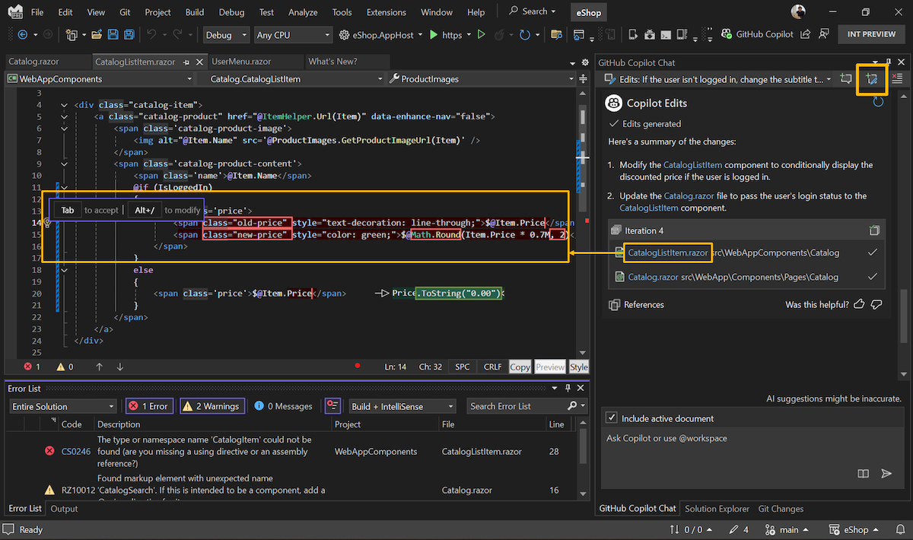

Copilot dans Visual Studio vous aide désormais à affiner votre code grâce à Copilot Edits, une fonctionnalité conçue pour rendre l'itération sur plusieurs fichiers plus efficace.

Commencez par cliquer sur le bouton de création d'un threading Edits en haut du panneau Copilot Chat.

Copilot Edits combine le flux conversationnel du chat avec une expérience de révision en ligne pour aider les développeurs :

1. **Aperçu avec clarté** : Copilot Edits commence par un résumé des fichiers affectés et des modifications proposées, afin que vous sachiez exactement ce qui se passe.
2. **Revue avec fluidité** : Affichez les différences de code en ligne, directement dans votre éditeur. Acceptez ou rejetez les modifications individuelles en utilisant les touches `TAB` ou `Alt+Del`, ou appliquez/ignorez tout d’un coup.
3. **Itérez en toute confiance** : Les points de contrôle vous permettent de revisiter les itérations précédentes d’un fichier de code ou d’essayer une approche différente quand vous en avez besoin—parfait pour quand l’inspiration frappe de nouveau.

Commencez par décrire les modifications que vous souhaitez en langage naturel, et faites référence à des fichiers spécifiques, des erreurs ou votre solution en utilisant la touche #, comme vous le faites déjà dans le chat Copilot.

### Vous voulez essayer ?
Activez GitHub Copilot Gratuit et déverrouillez cette fonctionnalité d’IA parmi d’autres.
 Pas de version d’évaluation. Pas de carte de crédit. Juste votre compte GitHub. [Obtenez Copilot Gratuit](vscmd://View.GitHub.Copilot.Chat).
