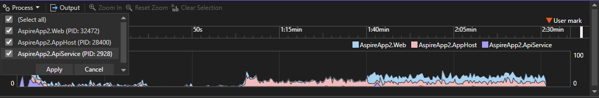

L’outil d’utilisation CPU du profiler de Visual Studio prend désormais en charge l’analyse multi-processus, affichant des graphiques de performance avec un codage couleur distinct pour chaque processus dans les couloirs.

Les graphiques sont affichés sous forme de graphiques en aires empilées. Vous avez également la possibilité de filtrer les processus à l’aide du menu déroulant en haut à gauche, permettant une analyse ciblée.

Cette amélioration vous permet de distinguer et d’analyser facilement l’utilisation du CPU entre les processus au sein d’une seule session. En fournissant des informations plus claires sur la consommation des ressources, cela améliore l’efficacité du profilage et rationalise l’optimisation des performances pour les applications multi-processus.
