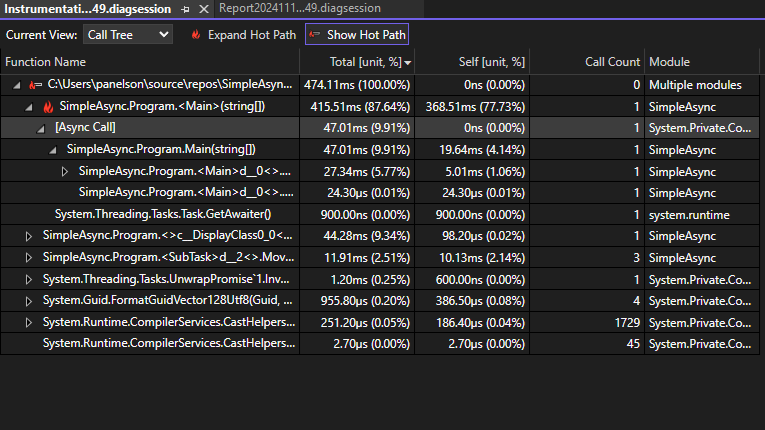

Le Profiler de Visual Studio améliore désormais le débogage des applications .NET en affichant des piles asynchrones assemblées dans les vues du résumé et de l’arborescence des appels de détails.

Cette fonctionnalité offre une vue plus claire et plus cohérente des opérations asynchrones, permettant aux développeurs de tracer le flux d’exécution complet, y compris les appels de méthodes asynchrones, le tout au sein d’une seule trace de pile unifiée.

En éliminant la nécessité d’assembler manuellement des chemins d’appels asynchrones séparés, cette amélioration vous aide à identifier rapidement les goulots d’étranglement des performances et à résoudre les problèmes plus efficacement.
