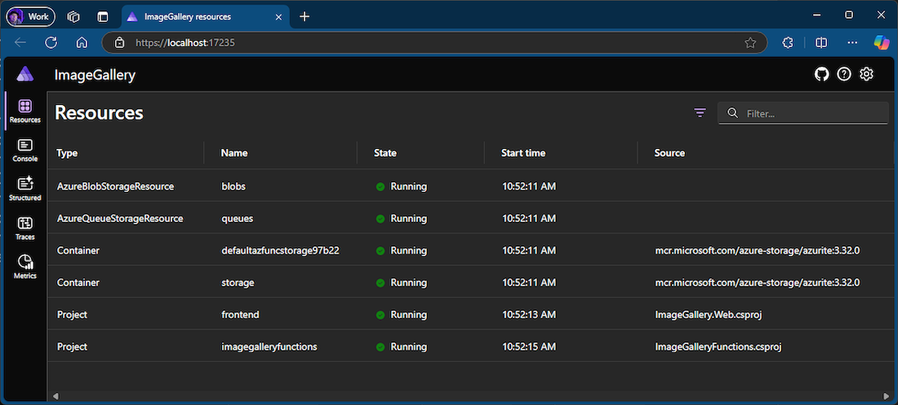

Con questa versione di Visual Studio, gli sviluppatori di Funzioni di Azure possono ora usare l'orchestrazione .NET Aspire durante la creazione di un nuovo progetto di Funzioni di Azure. Selezionando questa opzione, nella soluzione verranno inclusi un host app e un progetto Impostazioni predefinite del servizio al momento della creazione del progetto Funzioni.

Se si dispone di un progetto Funzioni di Azure esistente, ad esempio uno integrato con un'app Web front-end ASP.NET Core Blazor, è possibile aggiungere a esso il supporto .NET Aspire, proprio come con le app ASP.NET Core prima di questa versione.

Inoltre, l'esecuzione o il debug di un progetto Funzioni di Azure con il supporto .NET Aspire avvierà il dashboard .NET Aspire nel browser. In questo modo è possibile monitorare l'esecuzione di Funzioni di Azure in tempo reale. È possibile osservare il modo in cui l'agente di orchestrazione .NET Aspire gestisce l'esecuzione di Funzioni di Azure nonché sospenderne e riprenderne l'esecuzione dal dashboard.

Questa integrazione offre molte funzionalità e permette di incorporare Funzioni di Azure nei progetti .NET Aspire.
