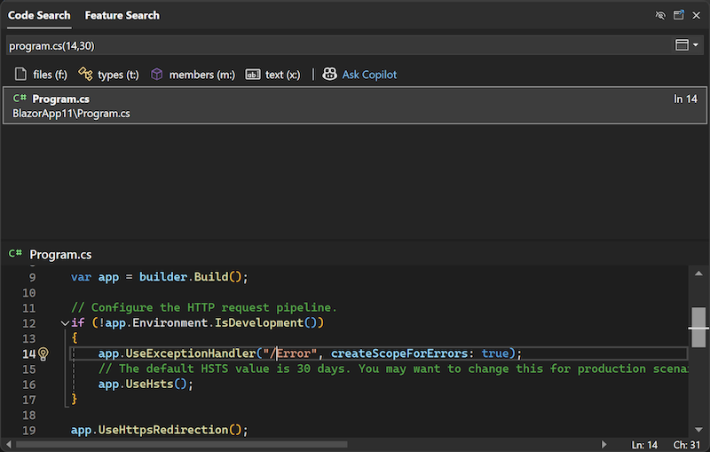

In [Code Search](vscmd://Edit.NavigateTo) sono state migliorate notevolmente le funzionalità di spostamento tra righe. Sono ora supportati i seguenti formati:

- `:line` per spostarsi su una riga specifica nel documento attivo
- `:line,col` per spostarsi su una riga e una colonna specifiche nel documento attivo
- `file:line` per spostarsi su una riga specifica in un file specificato
- `file:line,col` per spostarsi su una riga e una colonna specifiche in un file specificato
- `file(line)` per spostarsi su una riga specifica in un file specificato
- `file(line,col)` per spostarsi su una riga e una colonna specifiche in un file specificato

Questi miglioramenti semplificano e velocizzano l'individuazione e la modifica del codice, ottimizzando la produttività e semplificando il flusso di lavoro.
