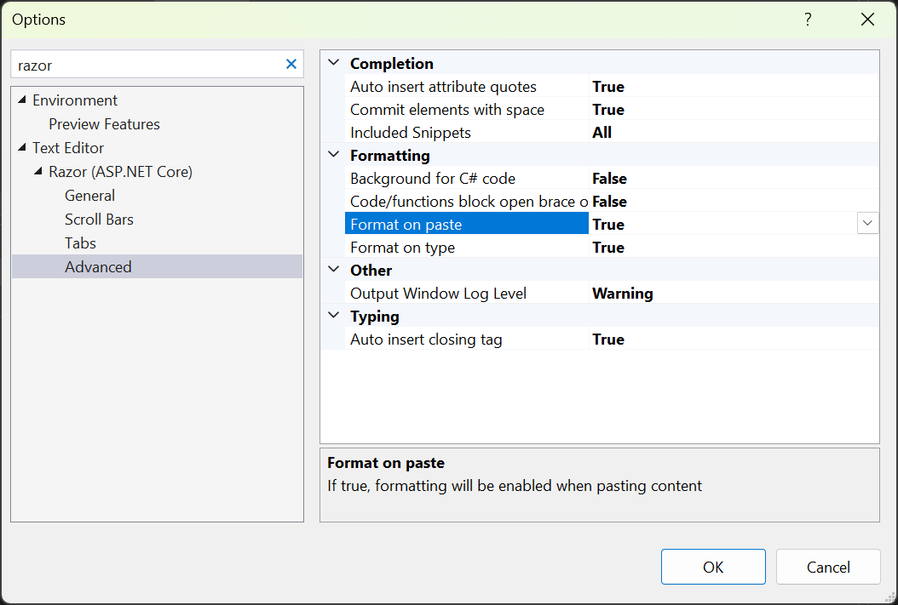

La funzionalità **Formatta su incolla** nei file Razor è più un ostacolo o un aiuto? È ora possibile disabilitare la formattazione automatica quando si incolla il codice nei file Razor.

Disabilitare l'impostazione passando a **Strumenti > Opzioni > Editor di testo > Razor (ASP.NET Core) > Avanzate** e deselezionando **Formatta su incolla**. 

