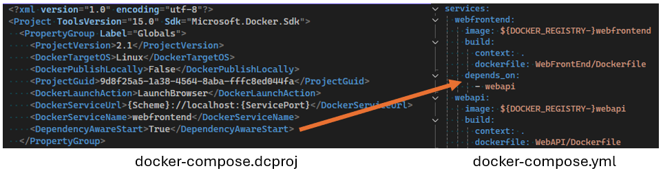

È disponibile una nuova opzione di configurazione di avvio denominata `DependencyAwareStart`. Se impostata su `True`, questa opzione modifica il modo in cui vengono avviati i progetti Docker Compose, permettendo l'uso della direttiva `depends_on` nella configurazione di Compose.

Questa funzionalità garantisce che i contenitori specificati vengano avviati nell'ordine corretto, rispettando i requisiti di dipendenza definiti nel file Docker Compose. Con una gestione più efficace delle dipendenze, migliora la robustezza e l'affidabilità delle applicazioni multi-contenitore.
