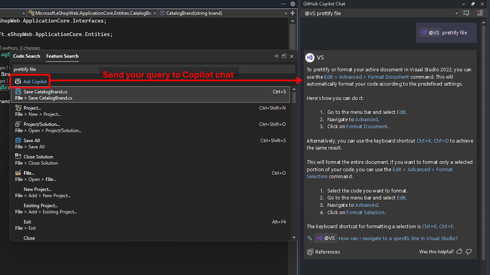

Si ha la necessità di trovare una voce di menu, un comando o un'opzione specifica in Visual Studio, ma non se ne conosce il nome o la posizione? È possibile trarre vantaggio da altri dettagli su come usarlo correttamente?

In [Ricerca per funzioni](vscmd://Window.QuickLaunch) è ora possibile inviare la query a Copilot Chat per ottenere una risposta dettagliata. Se non si è certi della terminologia specifica di una funzione, Copilot Chat può interpretare il significato semantico della query, valutare la versione di Visual Studio e fornire una risposta senza uscire dall'IDE.

Ad esempio, attualmente la ricerca di "prettify file" in Ricerca per funzioni non consente di trovare l'impostazione corretta "format document". Copilot Chat può tuttavia identificare e spiegare gli elementi pertinenti in Visual Studio.

Se la sottoscrizione a Copilot è configurata in Visual Studio, è sufficiente iniziare a digitare la ricerca in [Ricerca per funzioni](vscmd://Window.QuickLaunch) e fare clic sul pulsante **Chiedi a Copilot** per inviarla alla chat. 

Questa integrazione semplifica il flusso di lavoro fornendo assistenza immediata e sensibile al contesto direttamente nell'IDE.

### È possibile provare.
Attivare la versione gratuita di GitHub Copilot e sbloccare questa e altre funzionalità basate sull'intelligenza artificiale.
 Nessuna versione di valutazione. Nessuna carta di credito. Basta l'account GitHub. [Scaricare la versione gratuita di Copilot](vscmd://View.GitHub.Copilot.Chat).
