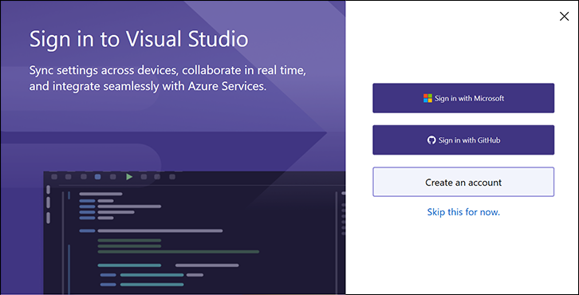
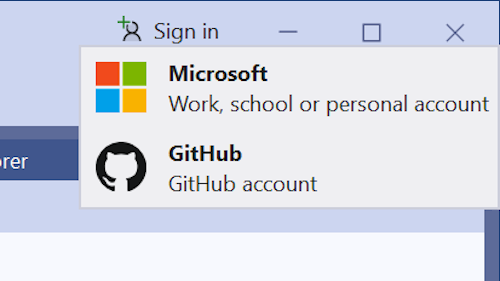

È necessario usare le risorse di GitHub? L'aggiunta dell'account GitHub è ora più semplice che mai. 

### Nuovi modi per accedere con l'account GitHub

Ora è possibile accedere con il proprio account GitHub durante la prima finestra di configurazione del lancio:

Se si decide di ignorare l'impostazione del primo account di avvio, è anche possibile accedere direttamente dalla shell di Visual Studio senza dover prima aggiungere un account Microsoft.

Si noti che non sarà possibile sincronizzare le impostazioni finché non si aggiunge un account Microsoft (aziendale o dell'istituto di istruzione o personale) a Visual Studio.
