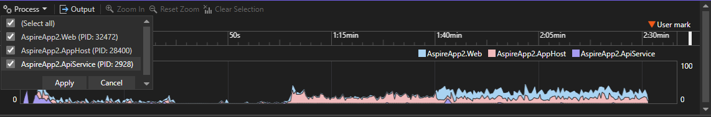

Lo strumento Utilizzo CPU del profiler di Visual Studio supporta ora l'analisi a più processi, visualizzando grafici delle prestazioni codificati a colori distinti per ogni processo nelle diverse corsie.

I grafici vengono visualizzati come grafici ad area in pila. È anche possibile filtrare i processi usando un elenco a discesa in alto a sinistra per eseguire un'analisi mirata.

Questo miglioramento permette di distinguere e analizzare facilmente l'utilizzo della CPU tra i processi all'interno di una singola sessione. Grazie a informazioni dettagliate più chiare sull'utilizzo delle risorse, si migliora l'efficienza della profilatura e si semplifica l'ottimizzazione delle prestazioni per le applicazioni a più processi.
