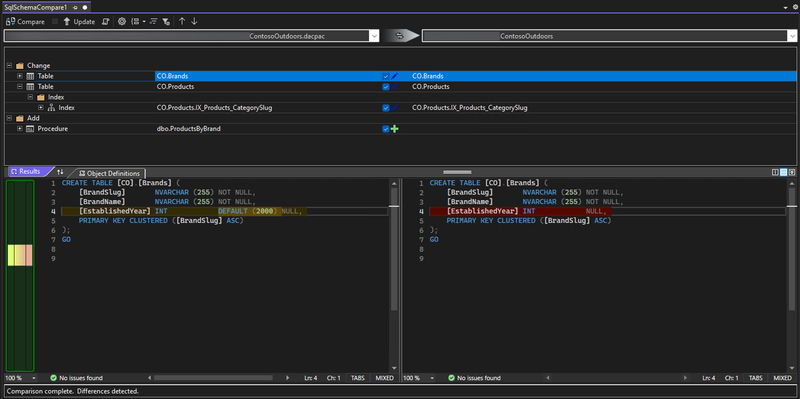

L'aggiornamento in Visual Studio 17.13 introduce le funzionalità di confronto schemi, confronto dati, riferimenti a progetto e debug SQL in SQL Server Data Tools in stile SDK (anteprima). I progetti SQL SSDT in stile SDK sono basati su Microsoft.Build.Sql SDK, che offre il supporto multipiattaforma e funzionalità CI/CD migliorate per i progetti SQL Server Data Tools (SSDT).

Nella versione 17.13 preview 3, il confronto schemi è limitato ai confronti tra database e pacchetti di applicazione livello dati. Il confronto tra progetti SQL non è ancora disponibile. I riferimenti al database sono ora disponibili come riferimenti a progetto nell'anteprima 3, il supporto per i riferimenti al database come riferimenti dacpac e riferimenti a pacchetti sarà disponibile in una versione futura. Una versione recente del [generatore di file di soluzioni slngen](https://github.com/microsoft/slngen) ha aggiunto anche il supporto per i progetti Microsoft.Build.Sql, consentendo la gestione di soluzioni di grandi dimensioni a livello di programmazione.

Inoltre, la finestra di progettazione tabelle e altre opzioni di script sono state migliorate in Esplora oggetti di SQL Server. Altre informazioni sull'uso del debugger SQL per esaminare codice T-SQL complesso negli ambienti di sviluppo dalla [documentazione](https://learn.microsoft.com/sql/ssdt/debugger/transact-sql-debugger).

Il minor livello di dettaglio dei file di progetto e dei riferimenti di database ai pacchetti NuGet consente ai team di collaborare in modo più efficiente su database di grandi dimensioni in un singolo progetto o di compilare più set di oggetti da diversi progetti. Le distribuzioni di database da un progetto di Microsoft.Build.Sql possono essere automatizzate in ambienti Windows e Linux in cui lo strumento dotnet Microsoft.SqlPackage pubblica l'artefatto della compilazione (con estensione .dacpac) dal progetto SQL. Altre informazioni sui [progetti SQL in stile SDK e DevOps per SQL](https://aka.ms/sqlprojects).

Assicurarsi di installare il componente più recente dell'anteprima di SSDT nel programma di installazione di Visual Studio per usare i progetti SQL in stile SDK nella soluzione.

