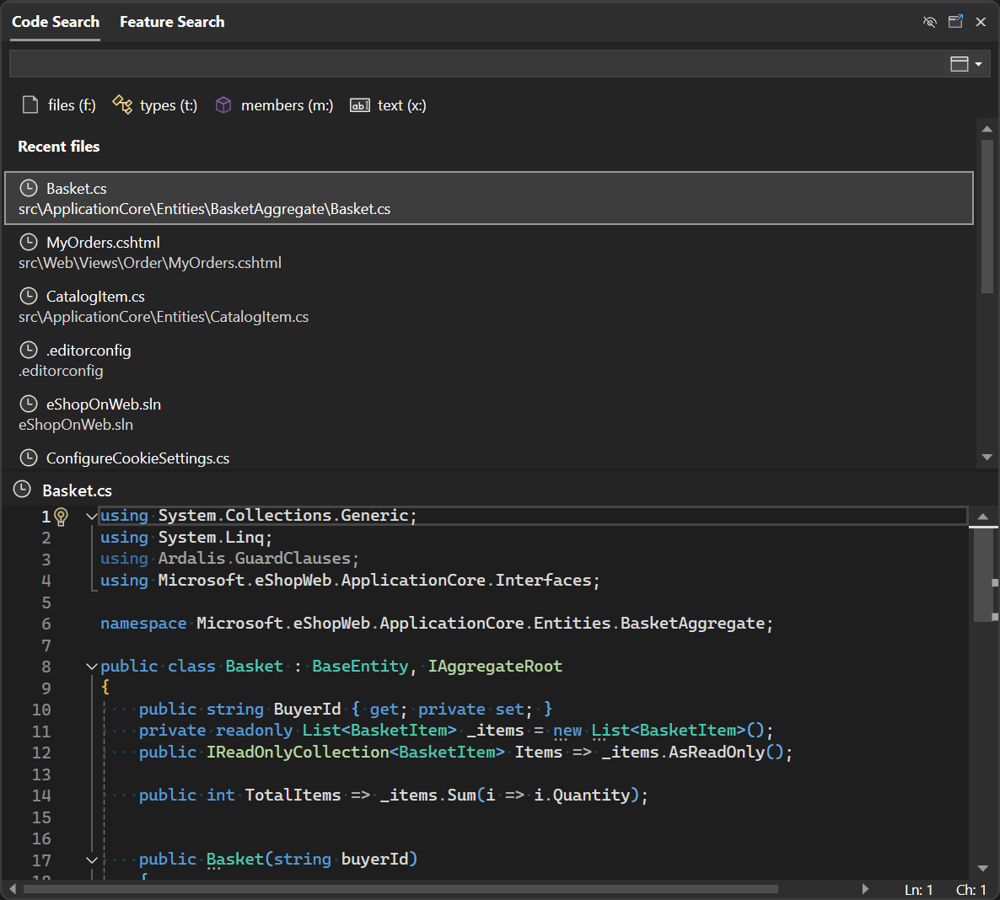

コードベース内をさらに簡単に移動できるようになりました。 

クエリなしで [Code Search](vscmd://Edit.NavigateTo) を開くと、最近移動したファイルの一覧が表示されます。 これには、Code Search で開いたファイルだけでなく、ソリューションで開いた他のファイルも含まれます。 これにより、ファイル名を覚えたり入力したりしなくても、最近作業していたファイルに簡単に戻ることができます。

