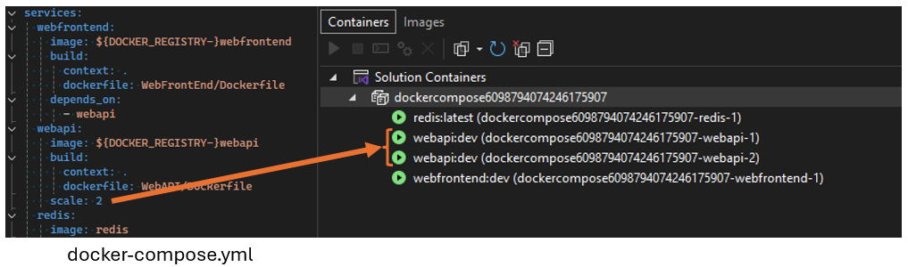

特定の数のレプリカを実行してデバッグするために、Docker Compose サービス構成に `scale` プロパティを追加できるようになりました。 たとえば、次の構成では、起動時に `webapi` サービスのインスタンスが 2 つ実行されます。

この機能強化により、運用環境に似た環境をシミュレートすることで、アプリケーションの負荷 テストとデバッグをより効果的に行うことができます。 また、Compose ファイルから直接、複数のインスタンスを簡単に管理できるため、ワークフローが効率化されます。 この機能は、負荷がかかっているサービスの動作をテストし、アプリケーションが複数のインスタンスをシームレスに処理できるようにする場合に特に便利です。
