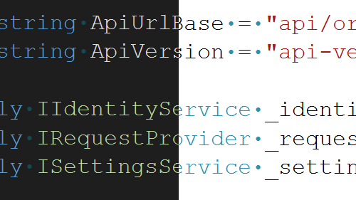

開発者が選択するフォントは、コーディングが個人的な選択であり、読みやすさ、アクセシビリティ、美学などの好みによる影響を受けます。 Visual Studio のテーマは主にプレゼンテーションの色に焦点を当て、好みのフォントに依存しません。

この更新プログラムでは、テーマを切り替えるときにフォント フェイスとサイズの選択を保持する機能が導入されました。 フォント設定を一度設定したら、Visual Studio でテーマを切り替える際に、毎回フォントを再設定しなくてもよくなりました。 フォントの色はテーマの目的であるため、テーマにリンクされたままですが、フォントの選択は保持されます。

この機能は、すべてのユーザーに対してデフォルトで有効になります。 以前の動作に戻す場合は、[[ツール] > [プレビュー機能の管理]](vscmd://Tools.ManagePreviewFeatures) の順に選択し、**[色テーマ選択肢とは異なるフォント設定]** オプションを探します。 このオプションをオンにすると、テーマの変更に関係なく、フォントの優先設定が維持されます。 このチェック ボックスをオフにすると、フォントの選択をテーマに結び付ける以前の動作に戻ります。
