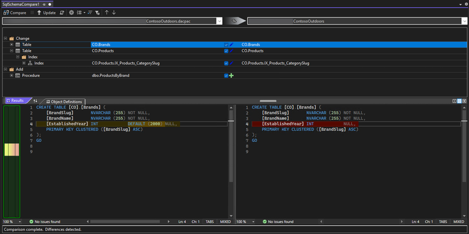
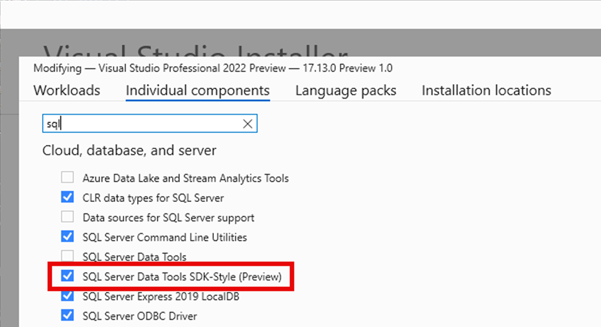

Visual Studio 17.13 の更新プログラムにより、スキーマ比較、データ比較、プロジェクト優先設定および、SDK スタイルの SQL Server Data Tools (プレビュー) への SQL デバッギングが導入されます。 SDK スタイルの SSDT SQL プロジェクトは、Microsoft.Build.Sql SDK に基づいており、SQL Server Data Tools (SSDT) プロジェクトにクロスプラットフォーム サポートと強化された CI/CD 機能をもたらします。

17.13 Preview 3 では、スキーマ比較はデータベースと .dacpac の比較に限定されます。SQL プロジェクトの比較はまだ使用できません。 データベース参照で、プレビュー 3 でプロジェクト参照として使用できるようになりました。dacpac 参照としてのデータベース参照とパッケージ参照のサポートは、今後リリースされる予定です。 [slngen ソリューション ファイル ジェネレーター](https://github.com/microsoft/slngen)の最近のリリースでは、Microsoft.Build.Sql プロジェクトのサポートも追加され、大規模なソリューションをプログラムで管理できるようになりました。

さらに、SQL Server Object Explorer でテーブル デザイナーやその他のスクリプト オプションが改善されました。 開発環境で複雑な T-SQL コードを調査するために SQL デバッガーを使用する方法の詳細については、[ドキュメント](https://learn.microsoft.com/sql/ssdt/debugger/transact-sql-debugger)を参照してください。

NuGet パッケージへのプロジェクト ファイルとデータベース参照を減らすことで、チームは、1 つのプロジェクトの大規模なデータベースでより効率的に共同作業を行ったり、複数のプロジェクトから複数のオブジェクト セットをコンパイルしたりできます。 Microsoft.Build.Sql プロジェクトからのデータベースデプロイは、Microsoft.SqlPackage dotnet ツールが SQL プロジェクトからビルド アーティファクト (.dacpac) を発行する Windows および Linux 環境で自動化できます。 [SDK スタイルの SQL プロジェクトと DevOps for SQL](https://aka.ms/sqlprojects)について確認する。

最新の SSDT プレビュー コンポーネントを Visual Studio インストーラーにインストールし、SDK スタイル SQL プロジェクトをソリューションで使用するようにします。

