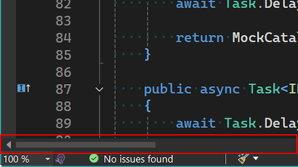
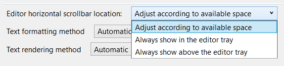

Visual Studio 편집기 트레이는 풍부한 정보를 보유한 귀중한 공간입니다. 줌을 조절하고, 문서의 상태를 확인하며, 현재 위치한 줄을 확인하고, 다양한 추가 정보를 접근할 수 있습니다.

이 정보들이 수평 스크롤바의 공간을 차지하게 되면, 창을 통해 스크롤하기 어려워질 수 있습니다. 이는 시스템 트레이가 좁은 병렬보기에서 특히 더 그렇습니다.

이번 최신 업데이트로 이러한 문제는 과거의 일이 되었습니다. 스크롤바가 사용 가능한 너비보다 작아지면, 항상 접근할 수 있도록 시스템 트레이 위로 위치를 변경합니다. 기본 적으로, 다시 충분한 공간이 확보되면 에디터 편집기로 돌아갑니다.

이 동작은 대부분의 사용자에게 이상적이지만 문제가 발생하는 경우 **도구 > 옵션**에서 동작을 제어할 수 있습니다. 해당 옵션은 **텍스트 편집기 > 고급** 아래 위치해 있으며, **편집기 수평 스크롤바 위치**라고 표시되어 있습니다. 이 설정은 스크롤바가 사용 가능한 공간에 따라 위치를 조정할지, 편집기 트레이에 고정될지, 아니면 항상 편집기 트레이 위에 표시될지를 선택할 수 있게 합니다.

