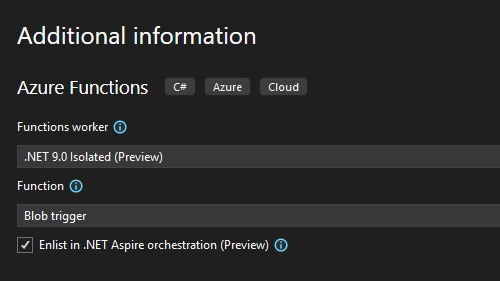

W tej wersji programu Visual Studio deweloperzy usługi Azure Functions mogą korzystać z orkiestracji platformy .NET Aspire podczas tworzenia nowego projektu usługi Azure Functions. Po wybraniu tej opcji zostanie uwzględniony projekt Host aplikacji i Wartości domyślne usługi w rozwiązaniu podczas tworzenia projektu usługi Functions.

Jeśli masz istniejący projekt Azure Functions, taki jak zintegrowany z ASP.NET aplikacją internetową frontonu platformy Blazor, możesz dodać do niego obsługę platformy .NET Aspire, tak samo jak w przypadku starszych aplikacji ASP.NET Core.

Ponadto uruchomienie lub debugowanie projektu usługi Azure Functions z obsługą platformy .NET Aspire spowoduje uruchomienie pulpitu nawigacyjnego platformy .NET Aspire w przeglądarce. Dzięki temu można monitorować wykonywanie usługi Azure Functions w czasie rzeczywistym. Możesz zobaczyć, jak orkiestrator platformy .NET Aspire zarządza wykonywaniem usługi Azure Functions, a nawet wstrzymywać i wznawiać wykonywanie usługi z poziomu pulpitu nawigacyjnego.

Z radością przedstawiamy tę integrację i nie możemy się doczekać Waszych integracji usługi Azure Functions z projektami platformy .NET Aspire.
