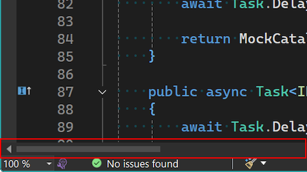

Zasobnik edytora w programie Visual Studio to cenne miejsce na mnóstwo informacji. Możesz kontrolować powiększanie, sprawdzać stan dokumentu, zobaczyć, który wiersz edytujesz, a także uzyskasz kilka dodatkowych informacji.

Niestety czasami wszystkie te informacje mogą zasłonić poziomy pasek przewijania, co utrudnia przewijanie okna. Dzieje się tak przede wszystkim w widoku obok siebie, gdzie zasobnik systemowy nie jest bardzo szeroki.

Dzięki najnowszej aktualizacji te trudności to już przeszłość. Jeśli szerokość paska przewijania zmniejszy się tak, że nie będzie można z niego korzystać, pojawi się on powyżej zasobnika systemowego, gdzie będzie zawsze dostępny. Domyślnie wróci do zasobnika edytora, gdy zwolni się wystarczająca ilość miejsca.

Chociaż uważamy, że to działanie będzie idealne dla większości użytkowników, jeśli wystąpią jakiekolwiek problemy, możesz kontrolować działanie w obszarze **Narzędzia > Opcje**. Opcja znajduje się w **Edytor tekstu > Zaawansowane** i jest oznaczona jako **Lokalizacja poziomego paska przewijania**. Pozwoli to na ustawienie, czy pasek przewijania ma dostosować swoje położenie zgodnie z dostępnym miejscem, pozostać na pasku zadań edytora lub zawsze pojawiać się nad zasobnikiem edytora.

