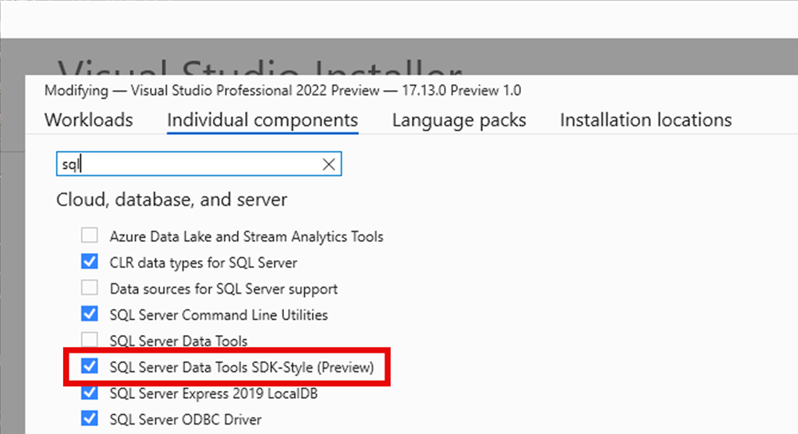

Aktualizacja Visual Studio 17.13 wprowadza porównanie schematów, porównanie danych, odwołania do projektu i debugowanie SQL do narzędzi SQL Server Data Tools w stylu zestawu SDK (wersja zapoznawcza). Projekty SSDT SQL w stylu SDK są oparte na zestawie Microsoft.Build.Sql SDK, który zapewnia obsługę wielu platform i ulepszone funkcje CI/CD dla projektów SQL Server Data Tools (SSDT).

W wersji 17.13 (wersja zapoznawcza 3) porównanie schematów jest ograniczone do porównań baz danych i plików .dacpac; porównanie projektów SQL nie jest jeszcze dostępne. Odwołania do bazy danych są teraz dostępne jako odwołania do projektu w wersji zapoznawczej 3. Obsługa odwołań do bazy danych jako odwołań dacpac i odwołań do pakietów zostaną udostępnione w przyszłej wersji. Najnowsza wersja [generatora plików rozwiązania slngen](https://github.com/microsoft/slngen) dodała również obsługę projektów Microsoft.Build.Sql, umożliwiając programowe zarządzanie dużymi rozwiązaniami.

Ponadto projektant tabel i inne opcje skryptu zostały ulepszone w programie SQL Server Object Explorer. Dowiedz się więcej na temat używania debugera SQL do kompleksowego badania kodu T-SQL w środowiskach programistycznych z [dokumentacji](https://learn.microsoft.com/sql/ssdt/debugger/transact-sql-debugger).

Dzięki mniej pełnym plikom projektu i odwołaniom bazy danych do pakietów NuGet zespoły mogą wydajniej współpracować nad dużymi bazami danych w jednym projekcie lub kompilować wiele zestawów obiektów z kilku projektów. Wdrożenia baz danych z projektu Microsoft.Build.Sql można zautomatyzować w środowiskach systemu Windows i Linux, w których narzędzie Microsoft.SqlPackage dotnet publikuje artefakt kompilacji (.dacpac) z projektu SQL. Dowiedz się więcej o [projektach SQL w stylu SDK i DevOps dla SQL](https://aka.ms/sqlprojects).

Pamiętaj o zainstalowaniu najnowszego składnika SSDT w wersji zapoznawczej w instalatorze programu Visual Studio, aby używać projektów SQL w stylu zestawu SDK w rozwiązaniu.

