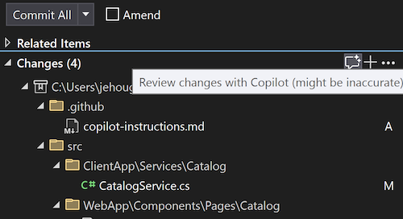

Agora, você pode obter uma revisão de código do GitHub Copilot em suas alterações locais antes mesmo de confirmar! Com sua assinatura do Copilot habilitada no Visual Studio e os sinalizadores de recurso a seguir habilitados, você pode ver o novo botão de comentário de brilho na janela Alterações do Git. Quando você clicar, o Copilot analisará os conjuntos de alterações e fará algumas sugestões embutidas no editor.

O modelo pode apontar pontos críticos, como possíveis problemas de performance e segurança, que, quando detectados precocemente, ajudam a reduzir o risco de empurrar problemas para a base de código remota.

Verifique se estes dois sinalizadores de recurso estão ativados:

- **Ferramentas** > **Opções** > **Recursos de visualização** > **Comentários de solicitação de pull**
- **Ferramentas** > **Opções** > **GitHub** > **Copilot** > **Integração de Controle do Código-Fonte** > **Habilite os recursos de visualização do Git**.

### Quer experimentar?
Ative o GitHub Copilot Free e desbloqueie esse recurso de IA, além de muito mais.
 Sem trials. Sem cartão de crédito. Apenas sua conta do GitHub. [Obtenha o Copilot Free](vscmd://View.GitHub.Copilot.Chat).
