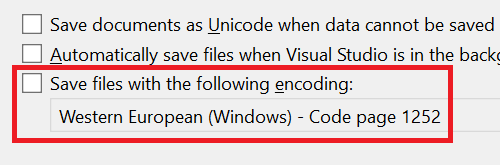

Os desenvolvedores que trabalham em ambientes multiplataforma geralmente precisam que os arquivos sejam salvos com codificações de arquivo específicas. Alterar essas codificações pode levar a vários problemas.

O Visual Studio agora permite que você defina a codificação de arquivo padrão para salvar arquivos. Esse recurso garante que sua codificação preferida seja usada sempre que possível.

Para definir a codificação padrão, navegue até **Ferramentas > Opções > Ambiente > Documentos**. Lá, você encontrará uma opção intitulada **Salvar arquivos com uma codificação específica**. Se essa opção estiver desmarcada, o Visual Studio gerenciará a codificação do arquivo usando seu comportamento padrão. Se marcada, o Visual Studio usará a codificação especificada na caixa de combinação adjacente sempre que um arquivo for salvo.

Se o Visual Studio não puder salvar com a codificação especificada (por exemplo, solicitando a codificação *ASCII* para um arquivo que contém caracteres Unicode), ele exibirá uma caixa de diálogo informando sobre o problema.
