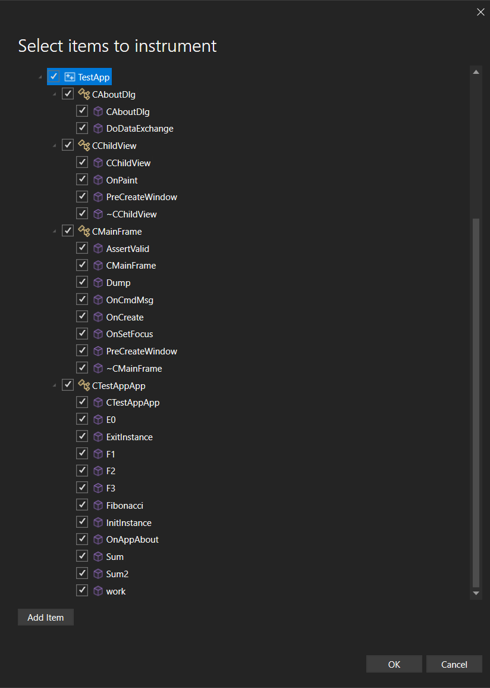

Agora, a ferramenta de instrumentação do Profiler do Visual Studio dá suporte à instrumentação direcionada de código nativo, permitindo selecionar classes e funções específicas para análise detalhada.

Este recurso aperfeiçoa o monitoramento de desempenho e ajuda a identificar problemas de modo mais eficiente, simplificando o processo de depuração.

Essa precisão habilita insights mais profundos sobre gargalos de desempenho e acelera os seus esforços de criação de perfil.
